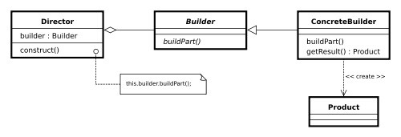

# Creational Design Patterns Homework

## Builder pattern

### Мотивация

Builder Pattern-ът разделя логиката по създаването на обекта от използването му. Така един и същи процес на конструиране може да създаде обекти с различни данни. Този шаблон енкапсулира и опростява създаването на обекта. Благодарение на него се избяга подаване на голям брой параметри, order dependency и множество конструктори.

Шаблонът си служи с Director, абстрактен Builder (определя логиката по създаването, последователността) и конкретен Builder, който отговаря за конкретната имплементация на създаването.

### Цел

Целта е да се раздели създаването на сложен обект от неговото представяне (интерфейс), за да може с един и същ процес да се създават обекти с различно представяне.

### Имплементация 

```cs 
using System;
using System.Collections;

  public class MainApp
  {
    public static void Main()
    { 
      // Create director and builders 
      Director director = new Director();

      Builder b1 = new ConcreteBuilder1();
      Builder b2 = new ConcreteBuilder2();

      // Construct two products 
      director.Construct(b1);
      Product p1 = b1.GetResult();
      p1.Show();

      director.Construct(b2);
      Product p2 = b2.GetResult();
      p2.Show();

      // Wait for user 
      Console.Read();
    }
  }

  // "Director" 
  class Director
  {
    // Builder uses a complex series of steps 
    public void Construct(Builder builder)
    {
      builder.BuildPartA();
      builder.BuildPartB();
    }
  }

  // "Builder" 
  abstract class Builder
  {
    public abstract void BuildPartA();
    public abstract void BuildPartB();
    public abstract Product GetResult();
  }

  // "ConcreteBuilder1" 
  class ConcreteBuilder1 : Builder
  {
    private Product product = new Product();

    public override void BuildPartA()
    {
      product.Add("PartA");
    }

    public override void BuildPartB()
    {
      product.Add("PartB");
    }

    public override Product GetResult()
    {
      return product;
    }
  }

  // "ConcreteBuilder2" 
  class ConcreteBuilder2 : Builder
  {
    private Product product = new Product();

    public override void BuildPartA()
    {
      product.Add("PartX");
    }

    public override void BuildPartB()
    {
      product.Add("PartY");
    }

    public override Product GetResult()
    {
      return product;
    }
  }

  // "Product" 
  class Product
  {
    ArrayList parts = new ArrayList();

    public void Add(string part)
    {
      parts.Add(part);
    }

    public void Show()
    {
      Console.WriteLine("\nProduct Parts -------");
      foreach (string part in parts)
        Console.WriteLine(part);
    }
  }
```

### Последствия
* скрива функционалност, когато има много неща за изграждането на един обект
* конструиране на елементите в определен ред

### Структура


### Сродни модели
* Simple Factory
* Factory Method
* Abstract Factory

### Проблеми
Създаване на един сложен обект. Спецификацията на този обект се съхранва във вторичен клас. Така за изграждането на един определен обект трябва да се използва един от многото варианти на конструиране и да се създаде инстанция в първичното изграждане ('дирктора')
